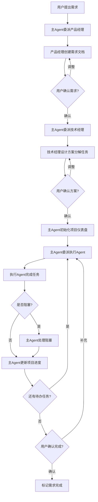

# SubAgent系统使用指南

> 本文档介绍如何使用SubAgent系统完成需求开发。SubAgent系统将文档框架与角色分工结合,通过专业化的AI助手团队高效完成需求。

**版本**: v1.0
**最后更新**: 2025-11-13
**适用场景**: 所有使用文档框架v2.0的项目

---

## 📋 系统概述

### 什么是SubAgent系统?

SubAgent系统是基于文档框架v2.0的**AI协作团队**,将需求开发流程拆分为专业化角色:

- **主Agent** (项目经理/编排器): 协调整体流程,维护项目进度
- **产品经理Agent**: 需求分析、需求文档编写
- **技术经理Agent**: 技术方案设计、任务分解
- **执行Agent**: 代码开发、任务执行
- **测试Agent**: 测试验证、质量保证(可选)

### 核心优势

1. **职责清晰**: 每个Agent专注于自己的领域,不跨界
2. **文档规范**: 严格遵循文档框架,单一数据源
3. **Human-in-the-loop**: 关键决策点请求用户确认
4. **可追溯**: 所有决策和变更都有完整记录
5. **高效协作**: 自动化流程编排,减少人工干预

---

## 🏗️ 系统架构

### Agent角色矩阵

| Agent | 主要职责 | 负责文档 | 工具权限 | 何时使用 |
|-------|---------|---------|---------|---------|
| **主Agent** | 流程编排、进度维护 | `00-PROJECT-STATUS.md`<br>`requirements/README.md`<br>`tasks/README.md` | 所有 | 始终运行,协调其他Agent |
| **产品经理** | 需求分析、文档编写 | `需求文档.md`<br>`00-PROJECT-STATUS.md`(初始化) | Read, Write, Edit, Grep, Glob | 新需求或需求变更时 |
| **技术经理** | 技术方案、任务分解 | `技术方案设计.md`<br>`tasks/README.md`<br>`TASK-00X.md`(创建) | Read, Write, Edit, Grep, Glob, Bash | 需求确认后,或技术评估 |
| **执行Agent** | 代码开发、任务执行 | `TASK-00X.md`(执行部分) | Read, Write, Edit, Bash, Grep, Glob | 有任务需要执行时 |
| **测试Agent** | 测试验证、质量保证 | `TASK-00X-测试.md` | Read, Write, Edit, Bash, Grep, Glob | 需要测试验证时 |

### 文档权限设计

**单一数据源原则**:

| 文档 | 数据源 | 维护者 | 其他Agent权限 |
|------|-------|--------|-------------|
| `00-PROJECT-STATUS.md` | ✅ 唯一 | 主Agent | 产品经理(初始化)、其他(只读) |
| `requirements/README.md` | ✅ 唯一 | 主Agent | 其他(只读) |
| `tasks/README.md` | ✅ 唯一 | 技术经理(创建)<br>主Agent(更新) | 其他(只读) |
| `需求文档.md` | ✅ 唯一 | 产品经理 | 其他(只读) |
| `技术方案设计.md` | ✅ 唯一 | 技术经理 | 其他(只读) |
| `TASK-00X.md` | ✅ 唯一 | 技术经理(创建)<br>执行/测试(更新) | 其他(只读) |

---

## 🚀 快速开始

### 前置条件

1. ✅ 已安装 Claude Code CLI
2. ✅ 项目已初始化文档框架v2.0
3. ✅ SubAgent配置文件已存在于 `.claude/agents/`

### 查看可用SubAgent

运行以下命令查看所有可用的SubAgent:

```bash
/agents
```

你应该看到:
- `product-manager` - 产品需求分析专家
- `tech-manager` - 技术方案设计和任务分解专家
- `task-executor` - 任务执行专家
- `tester` - 测试专家(可选)

---

## 📖 完整工作流程

### 流程1: 创建新需求

#### Step 1: 用户提出需求

向主Agent描述你的需求:

```
我需要实现一个员工ID映射功能,将旧系统的员工ID转换为新系统的ID。
```

#### Step 2: 主Agent委派产品经理

主Agent会自动委派产品经理Agent:

```
使用 product-manager SubAgent 分析需求并创建需求文档
```

#### Step 3: 产品经理分析需求

产品经理Agent会分析需求,可能出现**两种情况**:

**情况A: 需求信息充足,直接创建需求文档**

产品经理Agent会:
1. 创建需求目录结构
2. 创建需求文档 (`需求文档.md`)
3. 初始化项目仪表盘 (`00-PROJECT-STATUS.md`)
4. 返回需求概要给主Agent

然后跳转到 **Step 4**

**情况B: 需求信息不足,请求澄清** ⚠️

如果产品经理Agent发现需求描述存在以下问题:
- 核心目标不明确
- 功能范围模糊
- 约束条件缺失
- 验收标准不清
- 存在潜在冲突

产品经理Agent会返回**澄清请求**:

```markdown
## ⚠️ 需求澄清请求

在分析需求时,我发现以下问题需要澄清:

### 问题1: 核心目标不明确
- **当前理解**: 需要实现员工ID映射功能
- **不明确的点**: 是单向映射(旧→新)还是双向映射?
- **建议选项**:
  - 选项A: 仅支持旧→新
  - 选项B: 支持双向转换
- **请提供**: 请选择或说明

### 问题2: 性能要求缺失
- **当前理解**: 需要支持批量转换
- **不明确的点**: 批量大小?响应时间?
- **请提供**:
  - 预期批量大小(如1000条)
  - 可接受响应时间(如3秒内)

📋 请回答以上问题
```

然后跳转到 **Step 3.5**

---

#### Step 3.5: 主Agent转发澄清请求并收集用户答复 (仅当需求需要澄清时)

**主Agent会向用户转发澄清请求**:

```
⚠️ 产品经理Agent需要澄清以下问题才能准确创建需求文档:

### 问题1: 核心目标不明确
- **当前理解**: 需要实现员工ID映射功能
- **不明确的点**: 是单向映射(旧→新)还是双向映射?
- **建议选项**:
  - 选项A: 仅支持旧系统ID转换为新系统ID
  - 选项B: 支持双向转换(旧↔新)
- **请提供**: 请选择A或B,或说明其他需求

### 问题2: 性能要求缺失
- **当前理解**: 需要支持批量转换
- **不明确的点**: 批量大小?响应时间要求?
- **请提供**:
  - 预期的批量大小(如1000条)
  - 可接受的响应时间(如3秒内)

📋 **请回答以上问题**,我将把您的答复转发给产品经理Agent。
```

**用户提供答复**:

```
问题1: 选择A,仅支持单向转换(旧→新)
问题2:
- 批量大小: 最多500条
- 响应时间: 2秒内
```

**主Agent再次委派产品经理Agent**:

```
使用 product-manager SubAgent 根据用户澄清信息创建需求文档。

原需求: 实现员工ID映射功能

澄清信息:
- 问题1答案: 仅支持单向转换(旧→新)
- 问题2答案: 批量最多500条,响应时间2秒内
```

**产品经理Agent基于澄清信息创建完整需求文档**,然后继续 **Step 4**

---

#### Step 4: 主Agent请求用户确认需求

主Agent会展示需求文档关键内容:

```
✅ 需求文档已创建完成

**需求ID**: REQ-004
**需求名称**: 员工ID映射功能
**优先级**: P1

**核心内容**:
- 核心目标: 实现旧系统员工ID到新系统ID的转换
- 功能范围: [3-5个要点]
- 验收标准: [关键验收条件]

📋 请确认以下内容:
1. 需求理解是否正确?
2. 功能范围是否符合预期?
3. 验收标准是否清晰?

**是否确认继续进行技术方案设计?**
```

**用户回复**: "确认" 或提出调整建议

#### Step 5: 主Agent委派技术经理

用户确认后,主Agent委派技术经理Agent:

```
使用 tech-manager SubAgent 编写技术方案并分解任务
```

#### Step 6: 技术经理设计方案并分解任务

技术经理Agent会:
1. 分析需求和代码库
2. 创建技术方案 (`技术方案设计.md`)
3. 分解任务,创建任务总览 (`tasks/README.md`)
4. 创建任务卡片 (`TASK-001.md`, `TASK-002.md`, ...)
5. 返回技术方案概要给主Agent

#### Step 7: 主Agent请求用户确认方案

```
✅ 技术方案已完成

**技术方案概要**:
- 技术栈: TypeScript + React Hooks
- 任务总数: 5个
- 预估工时: 18h
- 关键里程碑: M1(数据模型), M2(核心开发), M3(测试验证)
- 主要风险: [风险列表]

📋 请确认以下内容:
1. 技术方案是否合理?
2. 任务分解是否合适?
3. 工时评估是否可接受?

**是否确认开始执行?**
```

**用户回复**: "确认" 或提出调整建议

#### Step 8: 主Agent初始化项目仪表盘

用户确认后,主Agent:
1. 更新 `00-PROJECT-STATUS.md` (任务进度表、待办清单)
2. 更新 `requirements/README.md` (需求索引)
3. 准备开始执行第一个任务

#### Step 9: 主Agent委派执行Agent

```
使用 task-executor SubAgent 执行 TASK-001
```

---

### 流程2: 执行任务

#### Step 1: 执行Agent接收任务

执行Agent会:
1. 读取任务卡片 (`TASK-001.md`)
2. 读取技术方案(了解上下文)
3. 更新任务状态为"进行中"

#### Step 2: 执行Agent完成任务

执行Agent会:
1. 按照任务卡片的技术方案编写代码
2. 运行测试验证
3. 更新任务卡片:
   - 状态: 进行中 → 已完成
   - 实际工时
   - 成功标准勾选
   - 产出物清单
   - 经验总结
4. 返回完成通知给主Agent

#### Step 3: 主Agent更新项目进度

主Agent会:
1. 更新 `tasks/README.md` (任务状态、工时、完成日期)
2. 更新 `00-PROJECT-STATUS.md` (进度、待办、完成度)
3. 判断下一步行动

#### Step 4: 继续下一个任务或完成需求

**如果还有待开始任务**:
```
使用 task-executor SubAgent 执行 TASK-002
```

**如果所有任务完成**:
```
🎉 需求 REQ-004 所有任务已完成!

**完成情况**:
- 总任务数: 5个
- 预估工时: 18h
- 实际工时: 16.5h
- 效率: 109%

📋 请确认需求是否可以标记为已完成?
```

---

### 流程3: 处理任务阻塞

#### Step 1: 执行Agent报告阻塞

如果执行Agent遇到无法解决的问题,会上报:

```
🚨 任务阻塞

**任务ID**: TASK-003
**问题类型**: 技术难题
**问题描述**: 官方API不支持批量ID转换,逐个调用性能不达标

**已尝试方案**:
1. 逐个调用API - 失败原因: 性能不达标(>10s)
2. 使用Promise.all并发 - 失败原因: 超出API限流

**建议方案**:
- 方案A: 实现本地缓存+批量预加载
- 方案B: 后端实现批量转换API
```

#### Step 2: 主Agent分析问题类型

主Agent会判断问题类型:

**技术难题** → 委派技术经理Agent重新评估方案
**需求不明确** → 委派产品经理Agent明确需求
**需要人类决策** → Human-in-the-loop请求用户决策

#### Step 3: 委派对应Agent或请求用户决策

示例 - 技术难题:
```
使用 tech-manager SubAgent 重新评估技术方案,解决以下问题:

问题描述: API性能问题
当前任务: TASK-003
执行Agent建议: 方案A(本地缓存)或方案B(后端API)
```

示例 - 需要人类决策:
```
🚨 需要您的决策

**问题**: API性能不达标

**可选方案**:
- **方案A**: 实现本地缓存+批量预加载
  - 优点: 不需要后端改动
  - 缺点: 数据可能不实时
  - 工时: +2h

- **方案B**: 后端实现批量转换API
  - 优点: 数据实时,性能好
  - 缺点: 需要后端配合
  - 工时: +4h

**执行Agent建议**: 方案A

📋 请您决策:
- [ ] 采用方案A
- [ ] 采用方案B
- [ ] 其他建议
```

#### Step 4: 问题解决后继续任务

技术经理Agent调整方案或用户提供决策后,主Agent会:
1. 更新 `00-PROJECT-STATUS.md` (移除阻塞问题,记录决策)
2. 通知执行Agent继续任务

---

### 流程4: 需求变更

#### Step 1: 用户提出变更

```
需求变更:员工ID映射功能需要支持部门级别的批量导入
```

#### Step 2: 主Agent委派产品经理

```
使用 product-manager SubAgent 修改需求 REQ-004

变更内容: 新增部门级别批量导入功能
```

#### Step 3: 产品经理评估影响

产品经理Agent会:
1. 更新需求文档 (`需求文档.md`)
2. 分析变更影响:
   - 技术方案影响
   - 现有任务影响
   - 新增任务需求
3. 返回影响评估给主Agent

#### Step 4: 主Agent请求用户确认影响

```
⚠️ 需求变更影响评估

**变更内容**: 新增部门级别批量导入

**影响评估**:
- **技术方案影响**: 需要新增批量导入模块
- **任务影响**:
  - TASK-004需要调整(新增批量导入UI)
  - 新增TASK-006(批量导入逻辑)
- **工时影响**: +6h (原18h → 新24h)
- **进度影响**: +1天

📋 请确认是否继续:
- [ ] 确认变更,继续执行
- [ ] 需要重新评估
- [ ] 取消变更
```

#### Step 5: 用户确认后,委派技术经理调整

```
使用 tech-manager SubAgent 调整技术方案和任务

变更内容: 新增部门级别批量导入
影响评估: [产品经理提供的评估]
```

#### Step 6: 技术经理调整方案和任务

技术经理Agent会:
1. 更新技术方案 (`技术方案设计.md`)
2. 修改受影响的任务 (`TASK-004.md`)
3. 新增任务 (`TASK-006.md`)
4. 更新任务总览 (`tasks/README.md`)
5. 返回调整结果给主Agent

#### Step 7: 主Agent更新项目进度

1. 更新 `00-PROJECT-STATUS.md` (关键决策记录、任务进度)
2. 继续或重新执行受影响的任务

---

## 💡 最佳实践

### 1. 需求描述的清晰度

SubAgent系统支持**需求澄清流程**,即使需求描述不完整,产品经理Agent也会主动请求澄清。

**❌ 极简需求描述** (会触发澄清流程):
```
帮我做一个功能
```
产品经理Agent会问:要做什么功能?解决什么问题?

**⚪ 模糊需求描述** (可能触发澄清流程):
```
我需要实现员工ID映射功能
```
产品经理Agent可能会问:
- 单向还是双向映射?
- 性能要求是什么?
- 数据从哪里来?

**✅ 清晰需求描述** (直接创建需求文档):
```
我需要实现一个员工ID映射功能,用于将旧系统(字符串格式,如"EMP001")的员工ID
转换为新系统(数字格式,如1001)的ID。

**功能要求**:
- 仅支持单向转换(旧→新)
- 支持单个转换和批量转换(最多500条)
- 批量转换响应时间<2秒

**数据来源**: 从后端API获取映射关系
```

**建议**:
- ✅ **清晰描述更高效**: 减少澄清来回,加快进度
- ✅ **模糊描述也没关系**: 产品经理Agent会主动澄清,确保需求准确
- ❌ **不要担心描述不完整**: 系统会引导你补充信息

### 2. 及时回复澄清和确认请求

主Agent在以下时机会请求澄清或确认,请**及时回复**:

**澄清类请求** (需要补充信息):
- ⚠️ **需求澄清** → 产品经理Agent需要补充需求信息
  - 示例: 核心目标不明确、功能范围模糊、性能要求缺失
  - 回复: 提供具体信息或选择建议选项

**确认类请求** (需要决策):
- ✅ **需求文档确认** → 确认需求理解是否正确
- ✅ **技术方案确认** → 确认技术选型和工时评估
- ✅ **需求变更确认** → 确认变更范围和工时影响
- ✅ **任务阻塞决策** → 选择解决方案
- ✅ **需求完成确认** → 确认验收标准满足

**回复技巧**:
- 对于澄清请求: 直接回答问题或选择建议选项
- 对于确认请求: 简单回复"确认"或提出调整意见

### 3. 信任SubAgent的专业性

每个SubAgent都有明确的职责和专业知识:

- 📋 **产品经理Agent**: 信任其需求分析和验收标准制定
- 🔧 **技术经理Agent**: 信任其技术选型和任务分解
- 💻 **执行Agent**: 信任其代码实现和质量把控
- ✅ **测试Agent**: 信任其测试覆盖和质量验证

如果对某个Agent的输出有疑问,可以要求主Agent重新委派或调整。

### 4. 理解单一数据源原则

**项目进度的唯一真实来源**: `00-PROJECT-STATUS.md`

- 想知道当前状态? → 查看 `00-PROJECT-STATUS.md` 的"一分钟速览"
- 想知道下一步做什么? → 查看 `00-PROJECT-STATUS.md` 的"待办清单"
- 想知道任务进度? → 查看 `00-PROJECT-STATUS.md` 的"任务进度总览"

**任务状态的唯一数据源**: `tasks/README.md`

- 主Agent会基于执行Agent的完成通知更新此文件
- `00-PROJECT-STATUS.md` 从这里引用汇总

### 5. 跨会话恢复工作

如果需要继续之前的工作,向主Agent提供:

```
我需要继续需求 REQ-004 的工作。

请先阅读:
docs/requirements/REQ-004-员工ID映射/00-PROJECT-STATUS.md

然后告诉我:
1. 项目现在是什么状态?
2. 下一步应该做什么?
3. 有没有阻塞问题?
```

主Agent会读取项目仪表盘并告诉你当前状态和下一步行动。

---

## 🔧 故障排查

### Q1: SubAgent没有自动使用怎么办?

**原因**: 主Agent可能不清楚何时使用SubAgent

**解决**:
1. 检查 `.claude/CLAUDE.md` 是否存在并配置正确
2. 显式告诉主Agent使用SubAgent:
   ```
   请使用 product-manager SubAgent 创建需求文档
   ```

### Q2: SubAgent创建的文档不符合模板怎么办?

**原因**: SubAgent可能没有正确读取模板

**解决**:
1. 检查 `docs/templates/` 目录是否存在所有模板
2. 要求主Agent重新委派并明确指定使用模板:
   ```
   请重新使用 product-manager SubAgent,严格按照
   docs/templates/requirement-template.md 模板创建需求文档
   ```

### Q3: 主Agent跳过了用户确认步骤怎么办?

**原因**: `.claude/CLAUDE.md` 配置可能不完整

**解决**:
1. 检查 `.claude/CLAUDE.md` 中的 "Human-in-the-loop" 规则
2. 明确告诉主Agent:
   ```
   请在需求文档完成后先请我确认,不要直接进行下一步
   ```

### Q4: 如何查看所有可用的SubAgent?

运行命令:
```bash
/agents
```

或者查看:
```bash
ls .claude/agents/
```

### Q5: 如何自定义SubAgent?

1. 复制现有SubAgent配置文件作为模板
2. 修改 `name`, `description`, `tools`, `model` 字段
3. 调整系统提示(YAML分隔线下的内容)
4. 保存到 `.claude/agents/` 目录

---

## 📊 工作流程图



---

## 📚 相关文档

- [文档框架使用指南](./文档框架使用指南.md) - 了解文档框架v2.0
- [文档更新指南](./文档更新指南.md) - 了解文档更新规范
- [主Agent配置](../../.claude/CLAUDE.md) - 主Agent的详细规则
- [SubAgent配置目录](../../.claude/agents/) - 所有SubAgent配置文件

---

## 🎓 学习路径

### 初学者

1. ✅ 阅读本文档的"系统概述"和"快速开始"
2. ✅ 运行 `/agents` 查看可用SubAgent
3. ✅ 尝试创建一个简单需求,体验完整流程
4. ✅ 查看 `docs/requirements/REQ-001-*/` 作为参考示例

### 进阶用户

1. ✅ 阅读 `.claude/CLAUDE.md` 了解主Agent编排逻辑
2. ✅ 阅读 `.claude/agents/` 下的SubAgent配置
3. ✅ 理解文档权限矩阵和单一数据源原则
4. ✅ 尝试处理需求变更和任务阻塞场景

### 高级用户

1. ✅ 自定义SubAgent配置适配团队流程
2. ✅ 优化SubAgent系统提示提升效果
3. ✅ 扩展SubAgent团队(如添加DevOps Agent)
4. ✅ 贡献改进建议到文档框架项目

---

**文档版本**: v1.0
**创建日期**: 2025-11-13
**维护者**: SubAgent系统架构团队
**反馈渠道**: 项目Issue或团队讨论组
